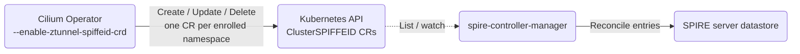

# CRD-based ztunnel Enrollment via ClusterSPIFFEID

**SIG: SIG-ServiceMesh** ([View all current SIGs](https://docs.cilium.io/en/stable/community/community/#all-sigs))

**Begin Design Discussion:** 2026-10-08

**Cilium Release:** TBD

**Authors:** Karina Ranadive <karanadive@microsoft.com>, Tamilmani Manoharan <tamanoha@microsoft.com>

**Status:** Draft

**Related CFP:** [Mutual Authentication for Service Mesh][cfp-mutual-auth]

## Summary

Cilium registers SPIRE identities for mutual auth **imperatively**: the Cilium
Operator calls the SPIRE **Entry API** to enroll ztunnel workloads, and a
`cilium-init` script calls it to create the bootstrap identities.

This CFP proposes **integrating `spire-controller-manager` and its declarative
CRDs into Cilium's SPIRE install**, so registration is expressed as Kubernetes
resources reconciled into the SPIRE server instead of imperative Entry-API calls:

* the Cilium Operator writes one **`ClusterSPIFFEID`** per enrolled namespace for
  workload enrollment, gated behind an opt-in `--enable-ztunnel-spiffeid-crd`
  flag (default off);
* bootstrap identities become **`ClusterStaticEntry`** resources, replacing the
  `cilium-init` step;
* a **`spire-controller-manager`** — added to Cilium's SPIRE chart using the
  upstream `spiffe/spire-controller-manager` image (as the chart already does for
  the SPIRE server and agent) — reconciles both CR types into the server.

The Kubernetes API becomes the source of truth for registration intent. The
existing Entry-API path is unchanged and remains the default when the flag is off.

## Motivation

Registering SPIRE identities through the Entry API couples Cilium to a directly
reachable SPIRE server and keeps the authoritative record of "what is enrolled"
inside the server's own datastore, reachable only through that API.

`spire-controller-manager` already provides a declarative CRD layer
(`ClusterSPIFFEID`, `ClusterStaticEntry`) that reconciles registration intent
into a SPIRE server. Adopting it in Cilium:

* removes the operator's direct SPIRE connection — it only needs Kubernetes RBAC
  to manage the CRs;
* makes the Kubernetes API the durable source of truth for registration intent;
* expresses bootstrap and workload registration through one reconciled mechanism.

## Goals

* Integrate `spire-controller-manager` and its CRDs into Cilium's SPIRE install
  so SPIRE registration is declarative rather than imperative Entry-API calls.
* Add an opt-in Cilium Operator backend that registers ztunnel workloads as
  `ClusterSPIFFEID` resources (one per enrolled namespace, SPIFFE ID rendered
  from namespace + service account), gated behind `--enable-ztunnel-spiffeid-crd`
  (default off), and removes the resource on unenrollment.
* Move bootstrap identities to `ClusterStaticEntry` resources reconciled by the
  controller manager.
* Keep the existing Entry-API path as the default, with no behavior change when
  the flag is off.

## Non-Goals

* **SPIRE server HA / topology** — replica count, datastore, and failover. This
  CFP works at any topology and does not change how the server is deployed or
  scaled. (The required `spire-controller-manager` + CRDs are a functional
  dependency of the registration mechanism, not an HA design — see Impacts.)
* Replacing or modifying the SPIRE datastore itself.
* Changes to SPIRE agents, the Cilium agent, or the mTLS datapath.
* Trust-root / CA management.
* Redefining the *purpose* of the bootstrap identities. This proposal changes
  **how** they are registered (declaratively via `ClusterStaticEntry`, replacing
  `cilium-init` — see Impacts), not what each identity is for.

## Proposal

### Overview



The ztunnel enrollment reconciler already abstracts registration behind a small
`SpireClient` interface (`Upsert`, `UpsertBatch`, `Delete`, `DeleteBatch`,
`Initialized`). This CFP adds a second implementation of that behavior inside
the SPIRE client, selected at runtime by the new flag, so no reconciler contract
changes.

### Operator flag and client wiring

The feature is gated behind [`--enable-ztunnel-spiffeid-crd`][flag-register]
(config field [`UseCRD`][config-field], default off). When enabled, `NewClient`
builds a dynamic client ([`dynamic.NewForConfig`][dyn-client]) and the SPIRE
client carries [`useCRD` / `dynamicClient`][client-fields].

At startup the client [skips the direct SPIRE server connection][onstart-crd]
when `useCRD` is set, and each registration method dispatches to the CRD backend:
[`Upsert`][upsert], [`UpsertBatch`][upsert-batch], [`Delete`][delete], and
[`DeleteBatch`][delete-batch].

### ClusterSPIFFEID per namespace

For each enrolled namespace the backend creates one cluster-scoped
`ClusterSPIFFEID` ([`buildClusterSPIFFEID`][build-csid]):

```go
// operator/pkg/ztunnel/spire/crd_client.go
obj.Object["spec"] = map[string]any{
    "spiffeIDTemplate": template, // spiffe://<trustDomain>/ns/{{ .PodMeta.Namespace }}/sa/{{ .PodSpec.ServiceAccountName }}
    "namespaceSelector": map[string]any{
        "matchLabels": map[string]any{
            "kubernetes.io/metadata.name": namespace,
        },
    },
}
```

Design points:

* **One CR per namespace**, scoped by `namespaceSelector`
  (`kubernetes.io/metadata.name=<namespace>`), rendering each pod's SPIFFE ID
  from its namespace and service account via the
  [`spiffeIDTemplate`][spiffe-template].
* **No `parentID`.** The SPIRE server assigns the attesting node agent
  dynamically, so the registration follows the workload across nodes with no CR
  change.
* **Server-side apply** ([`upsertNamespaceCRD`][upsert-ns]) so the operator owns
  only the fields it sets (name, labels, spec) and never clobbers fields owned by
  `spire-controller-manager` (finalizers, status, class name).
* **Ownership labels** (`app.kubernetes.io/managed-by: cilium-operator`) tag
  every CR the operator creates, so they can be identified without touching CRs
  owned by anything else.
* **Deterministic, DNS-safe names** ([`crdSPIFFEIDName`][csid-name]) that stay
  within the 63-character object-name limit by truncating and appending a short
  content hash for long namespace names.

### Unenrollment cleanup

When a namespace is unenrolled the backend deletes its `ClusterSPIFFEID`
([`deleteNamespaceCRD`][delete-ns]). Because the CR is namespace-scoped rather
than per-service-account, the reconciler [always includes the namespace on
delete][reconciler-ns-include] so the resource is removed even when the
namespace currently has no service accounts — otherwise it would leak:

```go
// operator/pkg/ztunnel/reconciler/reconciler.go — EnrollmentReconciler.Delete
if len(ids) == 0 {
    ids = append(ids, ns.Name+"/")
}
```

Deleting an individual service account is a no-op for this backend: the
namespace-scoped CR stays, and `spire-controller-manager` drops the entry for a
pod when the pod goes away.

## Impacts / Key Questions

### Impact: dependency on spire-controller-manager and the CRD

This backend only materializes entries if a `spire-controller-manager` is
running and the `ClusterSPIFFEID` CRD is installed and reconciled into the SPIRE
server. Because Cilium maintains the SPIRE install and includes neither today,
enabling this backend requires the following additions to Cilium's SPIRE chart
(all gated behind the Helm toggle; with the flag off none of it is installed and
behavior is unchanged):

* **`ClusterSPIFFEID` and `ClusterStaticEntry` CRDs** — install the CRD manifests
  from the `spire-controller-manager` project (`ClusterSPIFFEID` for workload
  enrollment; `ClusterStaticEntry` for the bootstrap identities).
* **`spire-controller-manager` workload** — deploy it (naturally as a sidecar in
  the existing `spire-server` StatefulSet, sharing the server's existing API
  socket `/tmp/spire-server/private/api.sock`), using the upstream
  `spiffe/spire-controller-manager` image, with config to watch `ClusterSPIFFEID`
  and reconcile into the colocated server.
* **Controller-manager RBAC** — watch/update `clusterspiffeids` (and status),
  plus any leases it uses for leader election.
* **Validating webhook** — `spire-controller-manager` ships a validating webhook;
  the chart must either configure it or disable it (e.g. an empty
  `ValidatingWebhookConfiguration`).
* **Operator RBAC** — allow the `cilium-operator` service account to
  create/update/delete `clusterspiffeids`.
* **Bootstrap `ClusterStaticEntry` CRs + remove `cilium-init`** — register the
  bootstrap identities (agent node-alias, cilium-agent, ztunnel) as
  `ClusterStaticEntry` CRs and drop the `cilium-init` step, so the controller
  manager is the single registration writer (see design decision below).
* **Flag plumbing** — a Helm value (e.g.
  `authentication.mutual.spire.install.spiffeIDCRD.enabled`) that wires
  `enable-ztunnel-spiffeid-crd` into the operator config and installs the above.

The SPIRE server config is otherwise unchanged — the server already exposes the
API socket that the controller manager connects to.

### Design decision: bootstrap registration via `ClusterStaticEntry` (drop `cilium-init`)

Introducing `spire-controller-manager` as a reconciler raises a two-writer
question with the existing `cilium-init` step. By default the controller manager
treats the server's entry set as its desired state and prunes any entry without a
backing CR — which would delete the `cilium-init` bootstrap entries on the first
reconcile.

**Proposed: move the bootstrap identities to `ClusterStaticEntry` CRs and remove
the `cilium-init` entry-registration step**, so the controller manager is the
single source of truth for every entry — bootstrap and workload alike. All
registration becomes declarative and there is no two-writer conflict.

* **Pros:** one declarative reconciler owns every entry; no two-writer race; no
  reliance on scoping config; bootstrap and workload registration use the same
  mechanism.
* **Cons:** removes `cilium-init` and adds the `ClusterStaticEntry` CRD plus the
  bootstrap CRs.

**Alternative — keep `cilium-init`:** leave bootstrap on the Entry API and set
`spire-controller-manager`'s `entryIDPrefix` so it manages only its own
(CR-derived) entries and ignores the `cilium-init` entries. Smaller change, but
two registration writers coexist and correctness depends on the prefix being set
correctly.

### Design decision: per-namespace CR (not per-service-account)

The backend creates **one `ClusterSPIFFEID` per namespace** with a template that
renders the SPIFFE ID from each pod's namespace + service account, rather than
one CR per service account. This keeps the object count low, lets a single
template cover every service account in the namespace, and avoids create/delete
churn as service accounts come and go. The trade-off is coarser ownership
granularity and that unenrollment cleanup must key on the namespace (handled
above).

<!-- Reference links -->

[cfp-mutual-auth]: https://github.com/cilium/design-cfps/blob/main/cilium/CFP-22215-mutual-auth-for-service-mesh.md
[flag-register]: https://github.com/karina-ranadive/cilium/blob/600727aeb47ef88a5cb95989636c25445efa5fd5/operator/pkg/ztunnel/spire/client.go#L90-L92
[config-field]: https://github.com/karina-ranadive/cilium/blob/600727aeb47ef88a5cb95989636c25445efa5fd5/operator/pkg/ztunnel/spire/client.go#L66
[client-fields]: https://github.com/karina-ranadive/cilium/blob/600727aeb47ef88a5cb95989636c25445efa5fd5/operator/pkg/ztunnel/spire/client.go#L123-L124
[dyn-client]: https://github.com/karina-ranadive/cilium/blob/600727aeb47ef88a5cb95989636c25445efa5fd5/operator/pkg/ztunnel/spire/client.go#L136
[onstart-crd]: https://github.com/karina-ranadive/cilium/blob/600727aeb47ef88a5cb95989636c25445efa5fd5/operator/pkg/ztunnel/spire/client.go#L164-L172
[upsert]: https://github.com/karina-ranadive/cilium/blob/600727aeb47ef88a5cb95989636c25445efa5fd5/operator/pkg/ztunnel/spire/client.go#L247
[upsert-batch]: https://github.com/karina-ranadive/cilium/blob/600727aeb47ef88a5cb95989636c25445efa5fd5/operator/pkg/ztunnel/spire/client.go#L307
[delete]: https://github.com/karina-ranadive/cilium/blob/600727aeb47ef88a5cb95989636c25445efa5fd5/operator/pkg/ztunnel/spire/client.go#L401
[delete-batch]: https://github.com/karina-ranadive/cilium/blob/600727aeb47ef88a5cb95989636c25445efa5fd5/operator/pkg/ztunnel/spire/client.go#L440
[build-csid]: https://github.com/karina-ranadive/cilium/blob/600727aeb47ef88a5cb95989636c25445efa5fd5/operator/pkg/ztunnel/spire/crd_client.go#L75-L104
[spiffe-template]: https://github.com/karina-ranadive/cilium/blob/600727aeb47ef88a5cb95989636c25445efa5fd5/operator/pkg/ztunnel/spire/crd_client.go#L92-L97
[upsert-ns]: https://github.com/karina-ranadive/cilium/blob/600727aeb47ef88a5cb95989636c25445efa5fd5/operator/pkg/ztunnel/spire/crd_client.go#L106-L116
[delete-ns]: https://github.com/karina-ranadive/cilium/blob/600727aeb47ef88a5cb95989636c25445efa5fd5/operator/pkg/ztunnel/spire/crd_client.go#L119-L127
[csid-name]: https://github.com/karina-ranadive/cilium/blob/600727aeb47ef88a5cb95989636c25445efa5fd5/operator/pkg/ztunnel/spire/crd_client.go#L62-L71
[reconciler-ns-include]: https://github.com/karina-ranadive/cilium/blob/600727aeb47ef88a5cb95989636c25445efa5fd5/operator/pkg/ztunnel/reconciler/reconciler.go#L88-L93
